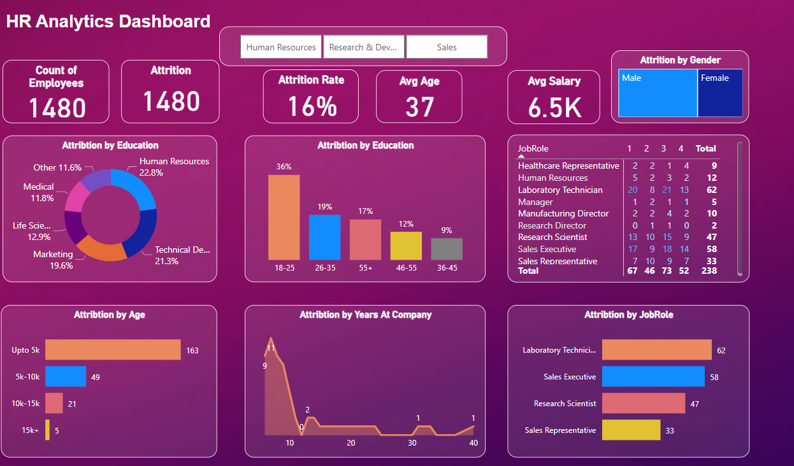

# HR Analytics Dashboard in Power BI
- This project involves the creation of an HR analytics dashboard using Power BI to analyze employee attrition based on various attributes.

## Dashboard
- The primary focus of the dashboard is to visualize and understand the factors contributing to employee attrition.

## Dataset
- The dashboard is built upon the HR_Analytics.csv dataset, which contains employee information.

